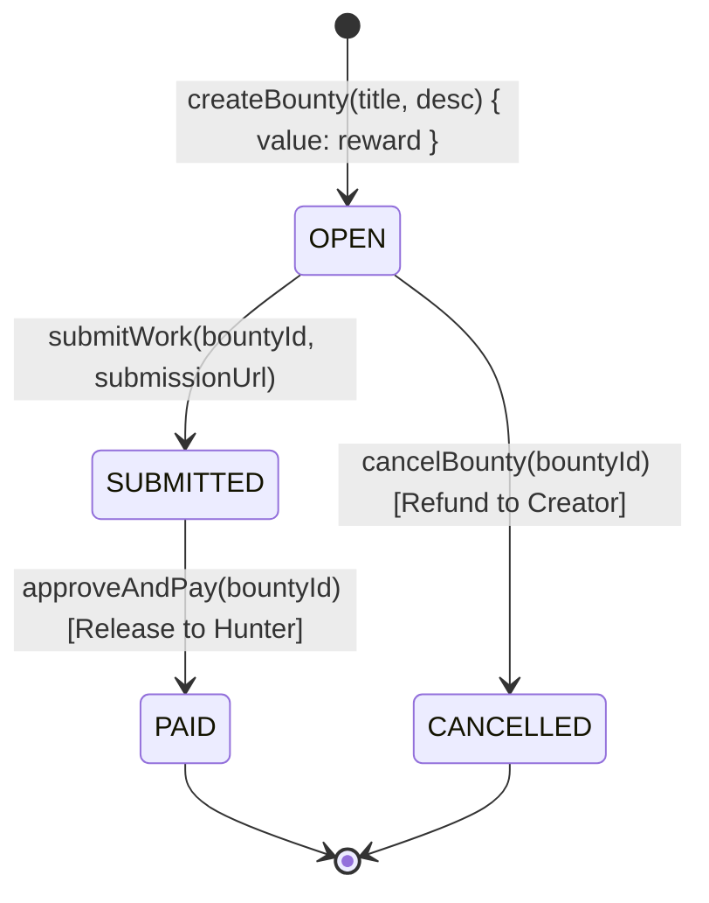

# 💎 BOT Bounties - Decentralized Bounty Marketplace

[](https://soliditylang.org/)
[](https://hardhat.org/)
[-brightgreen.svg)](https://scan.bohr.life)
[](https://docs.ethers.org/v6/)
[](LICENSE)

A full-stack decentralized developer bounty and milestone escrow platform built on the **BOT Chain Testnet** (EVM Chain ID `968`). 

The protocol allows project creators to lock native `BOT` tokens into trustless smart contract escrow, lets developers submit verifiable proof-of-work (GitHub PRs, commits, preview links), and enables atomic milestone payouts or guaranteed creator refunds.

---

## 🌟 Key Features

### 1. 🛡️ Trustless Native Escrow Architecture
- **Atomic Fund Locking**: Native `BOT` reward tokens are transferred and locked securely in the contract at the exact moment a bounty is created (`createBounty`).
- **Proof-of-Work Verification**: Developers submit proof of deliverable links (`submitWork`) that creators review on-chain.
- **Direct Payout Settlement**: Creators approve deliverables and release locked funds directly to the developer (`approveAndPay`) with zero protocol fees.
- **100% Refund Guarantee**: Creators can cancel open, unclaimed bounties (`cancelBounty`) to instantly receive a 100% refund of their escrowed deposit.

### 2. ⚡ Live MetaMask Account & Chain Switching (Zero Browser Reloads)
- Integrated event listeners for `accountsChanged` and `chainChanged` on the MetaMask provider (`window.ethereum`).
- Switching accounts in MetaMask immediately updates the connected address, signer instance, native balance, and permission states (Creator vs Hunter actions) without requiring a disruptive page refresh.

### 3. 🛑 Pre-Flight Balance & Reward Validation Guard
- Real-time client-side validation on bounty rewards before triggering MetaMask transactions.
- Prevents negative values, zero amounts, non-numeric values, or amounts exceeding the user's available `BOT` balance.
- **Protects users from failed gas estimations and cryptic RPC errors** by performing pre-flight balance checks with an inline balance badge and a quick `MAX` allocation helper.

### 4. 🔍 Direct Transaction Explorer Links
- When transactions (`createBounty`, `submitWork`, `approveAndPay`, `cancelBounty`) are broadcast and mined, rich toasts render direct clickable links (`View on Explorer ↗`) pointing directly to the transaction hash on the [BOT Chain Block Explorer](https://scan.bohr.life).

### 5. 🎨 Polished Dark-Mode Web3 UI
- Clean modal dialogs for creation, submission, contract configuration, and action confirmations (replacing native browser alerts and popups).
- Real-time protocol metrics (Total Escrow Value, Open Bounties, Under Review, Paid Bounties).
- Live search and filter tabs (All, Open, In Review, Settled, My Activity).

---

## 🌐 BOT Chain Testnet Specifications

| Parameter | Value |
| :--- | :--- |
| **Network Name** | BOT Chain Testnet (`botTestnet`) |
| **RPC Endpoint URL** | `https://rpc.bohr.life` |
| **Chain ID** | `968` (`0x3C8`) |
| **Currency Symbol** | `BOT` |
| **Decimals** | `18` |
| **Block Explorer** | [https://scan.bohr.life](https://scan.bohr.life) |

---

## 🚀 Quickstart & Setup

### Prerequisites
- Node.js `v18.x` or higher
- npm `v9.x` or higher
- MetaMask or any EVM-compatible browser extension wallet configured for BOT Chain Testnet

### 1. Install Dependencies
```bash
npm install
```

### 2. Launch Local Development Web App
```bash
npm start
# or
npm run dev
```
Open [http://localhost:3000](http://localhost:3000) in your browser.

---

### 3. Deploying to BOT Chain Testnet

1. Create a `.env` file from `.env.example`:
```bash
cp .env.example .env
```

2. Populate your private key (make sure the deployer address has testnet `BOT` tokens):
```env
PRIVATE_KEY=your_private_key_here
BOT_TESTNET_RPC_URL=https://rpc.bohr.life
```

3. Deploy the contract:
```bash
npm run deploy:testnet
```

4. The deployment script outputs your deployed contract address and explorer link:
```text
==================================================
🚀 Starting Deployment of BOT Bounties Contract...
==================================================
📡 Network: botTestnet (Chain ID: 968)
👤 Deployer Address: 0x...
💰 Deployer Balance: 10.0 BOT
--------------------------------------------------
⏳ Deploying BotBounties contract...
✅ BotBounties deployed successfully!
📍 Contract Address: 0x...
🔍 Explorer URL: https://scan.bohr.life/address/0x...
==================================================
```

5. Copy the deployed address into the DApp by clicking the **Contract** settings button in the top navigation bar or setting it in local storage.

---

### 4. Running Local Node & Local Deployment (Optional)

1. Start a local Hardhat node in a separate terminal:
```bash
npm run node
```
This spins up a local node at `http://127.0.0.1:8545` (Chain ID `31337`) with pre-funded accounts.

2. Deploy the contract to local node:
```bash
npm run deploy:local
```

---

### 5. Running Automated Unit Tests

The test suite covers full lifecycle workflows, negative cases, access control, and batch pagination:
```bash
npm test
```

Expected output:
```text
  BotBounties Smart Contract
    Deployment
      ✔ should start with 0 bounties
    createBounty
      ✔ should create a bounty and lock native BOT in escrow
      ✔ should revert if deposit is 0
      ✔ should revert if title is empty
    submitWork
      ✔ should allow a developer to submit proof of work URL
      ✔ should reject submission by the bounty creator
      ✔ should reject empty submission URL
      ✔ should reject submission on non-existent bounty
    approveAndPay
      ✔ should allow creator to approve and release native BOT escrow to hunter
      ✔ should reject approval by non-creator
      ✔ should reject approval if bounty is not in SUBMITTED status
    cancelBounty
      ✔ should allow creator to cancel an open bounty and refund escrow
      ✔ should reject cancellation by non-creator
      ✔ should reject cancellation once work has been submitted
    Pagination and Batch Read
      ✔ should return batch bounties properly

  15 passing (1s)
```

---

## 📂 Project Structure

```
BOT Chain Bounties/
├── contracts/
│   └── BotBounties.sol         # Solidity 0.8.20 Native Escrow Smart Contract
├── scripts/
│   └── deploy.js               # Hardhat Deployment Script with network reporting
├── test/
│   └── BotBounties.test.js     # 15 Comprehensive Unit & Lifecycle Tests
├── public/
│   ├── index.html              # Modern Web3 DApp UI & Dialog Components
│   ├── style.css               # Glassmorphism Dark Mode Styling & Toast System
│   └── app.js                  # Ethers.js v6 Client, Wallet Listeners & Validation
├── hardhat.config.js           # Hardhat Configuration (BOT Testnet + Localhost)
├── server.js                   # Lightweight Localhost Development Server
├── package.json                # Project Scripts & Dependencies
├── .env.example                # Example Environment Variables Template
└── README.md                   # Project Documentation
```

---

## 📜 Smart Contract Lifecycle & State Machine



### Smart Contract Methods
- `createBounty(string title, string description) payable returns (uint256)`: Deposits `msg.value` native `BOT` into escrow and registers bounty ID.
- `submitWork(uint256 bountyId, string submissionUrl)`: Links developer's deliverable URL and transitions status to `SUBMITTED`.
- `approveAndPay(uint256 bountyId)`: Creator releases 100% of escrowed funds atomically to the hunter.
- `cancelBounty(uint256 bountyId)`: Creator cancels an open, unclaimed bounty and receives full refund.
- `getBounty(uint256 bountyId) view returns (Bounty)`: Reads single bounty struct.
- `getBounties(uint256 offset, uint256 limit) view returns (Bounty[])`: Paginated batch query for frontend listings.
- `getBountyCount() view returns (uint256)`: Returns total bounties created.

---

## 🔒 Security Best Practices

- **Reentrancy Protection**: State updates precede token transfers (Checks-Effects-Interactions pattern).
- **Zero Locked Funds**: Cancelled and settled bounties immediately transfer native funds to creator or developer.
- **Strict Role-Based Guards**: Only the creator can approve payment or cancel bounties; creators cannot submit work on their own bounties.
- **Pre-Flight Client Guards**: Prevents gas burn from unexecutable transactions before triggering wallet signatures.

---

## 📄 License

This project is licensed under the [MIT License](LICENSE).
